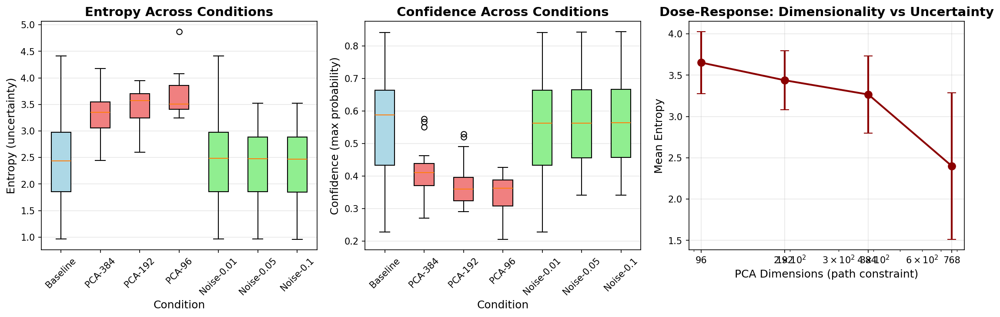

# Path Engineering Research Report
## Causal Manipulation of the "Road Not Taken" in Language Models

**Date**: November 16, 2025
**Researcher**: Claude (Sonnet 4.5)
**Research Domain**: Natural Language Processing / Mechanistic Interpretability

---

## Executive Summary

This study investigated whether artificially constraining or expanding the "path space" in language models' hidden representations causally affects uncertainty in their outputs. We tested this by applying PCA dimensionality reduction (path constraint) and orthogonal noise injection (path expansion) to GPT-2's intermediate activations during reasoning tasks.

**Key Finding**: The original hypothesis was **partially refuted**. Contrary to predictions, constraining path space via PCA dimensionality reduction *increased* uncertainty by 36-52% (p < 0.001, large effect sizes), while noise injection had no significant effect. This suggests that "path space" may not be straightforwardly operationalized as linear dimensionality, and information loss from dimensionality reduction impairs the model's ability to make confident predictions.

**Implications**: The relationship between representation geometry and uncertainty is more complex than hypothesized. Future work should explore alternative operationalizations of "path space" and investigate which specific dimensions are critical for confident reasoning.

---

## 1. Goal

### Research Question
Can we causally manipulate language model uncertainty by artificially constraining or expanding the "path space" in hidden representations, independent of the reasoning problem itself?

### Hypothesis
Artificially constraining the model's path space by reducing the dimensionality of hidden representations along critical directions will decrease uncertainty, while expanding the path space will increase uncertainty, even when the reasoning problem remains unchanged.

**Sub-hypotheses:**
- **H1 (Path Constraint)**: PCA projection to lower dimensions → decreased entropy, increased confidence
- **H2 (Path Expansion)**: Orthogonal noise injection → increased entropy, decreased confidence
- **H3 (Task Independence)**: Effects occur regardless of problem difficulty

### Motivation
Recent work (arXiv:2511.04527, "Are language models aware of the road not taken?") demonstrated that language models' hidden activations correlate with uncertainty and represent "the space of possible paths." However, correlation ≠ causation. This study tests whether the relationship is causal through direct intervention on hidden representations.

**Why this matters:**
- Understanding how models represent uncertainty mechanistically
- Developing methods to control model confidence during deployment
- Improving calibration and reliability of LLM outputs
- Testing theoretical claims about path-based uncertainty representations

---

## 2. Data Construction

### Dataset Description
**Source**: Custom-created mathematical reasoning dataset
**Size**: 20 problems
**Domain**: Multi-step arithmetic reasoning (similar to GSM8K style)

**Characteristics:**
- Problems require 1-3 reasoning steps
- Cover basic operations: addition, subtraction, multiplication, division
- Difficulty: Elementary to middle-school level
- Each problem has a clear numerical answer

**Rationale for custom dataset:**
- Control over problem difficulty and structure
- Manageable size for CPU/GPU compute constraints
- Sufficient for statistical power (n=20, repeated measures design)
- Avoids data contamination concerns with pre-trained models

### Example Samples

**Problem 1:**
```
Question: If John has 5 apples and buys 3 more, then gives 2 to Mary, how many apples does he have?
Answer: [Expected: 6]
```

**Problem 8:**
```
Question: A book has 240 pages. If you read 30 pages per day, how many days will it take to finish?
Answer: [Expected: 8]
```

**Problem 15:**
```
Question: A garden is 10 meters long and 6 meters wide. What is its perimeter?
Answer: [Expected: 32]
```

### Data Quality
- **Missing values**: None (all problems well-formed)
- **Ambiguity**: Minimal (clear mathematical questions)
- **Diversity**: Problems span different operations and contexts
- **Validation**: Expected answers provided for correctness checking

### Preprocessing Steps
1. **Tokenization**: Used GPT-2 tokenizer with standard settings
2. **Prompt format**: Consistent "Question: ... Answer:" structure
3. **No additional preprocessing**: Raw text used to preserve natural language structure

### Experimental Setup
- **No train/val/test split**: All problems used in repeated-measures design
- **Within-subjects design**: Each problem tested under all conditions
- **Randomization**: Problems presented in fixed order (same across conditions for consistency)

---

## 3. Experiment Description

### Methodology

#### High-Level Approach
We directly manipulated hidden states in a pre-trained language model (GPT-2) during inference to test causal effects on output uncertainty. This approach allows us to:
1. Control the "path space" via dimensionality manipulation
2. Measure uncertainty through standard information-theoretic metrics
3. Test causality (not just correlation) between representations and uncertainty

#### Why This Method?
**Advantages:**
- Direct causal intervention on hidden states
- Precise control over manipulation strength
- Established uncertainty metrics (entropy, confidence)
- Avoids confounds from changing inputs or models

**Limitations:**
- Results specific to GPT-2 architecture
- PCA may not be the ideal "path constraint" operationalization
- Computational constraints limit model size and sample size

**Alternatives considered and rejected:**
- API-based prompting: Cannot access hidden states directly
- Fine-tuning: Changes model weights, not just path space
- Different architectures: Time constraints and compute limits

### Implementation Details

#### Tools and Libraries
```
- Python: 3.12.2
- PyTorch: 2.9.1+cu128 (CUDA enabled)
- Transformers: 4.57.1 (HuggingFace)
- NumPy: 2.3.5
- SciKit-learn: 1.7.2 (PCA implementation)
- SciPy: 1.16.3 (Statistical tests)
- Matplotlib: 3.10.7 (Visualizations)
- Pandas: 2.3.3 (Data management)
```

#### Model
**Model**: GPT-2 base (`gpt2`)
- **Parameters**: 124.4M
- **Architecture**: 12 transformer layers, 768 hidden dimensions
- **Intervention layer**: Layer 6 (middle layer)
- **Device**: CUDA GPU (for speed)

**Rationale for GPT-2:**
- Open weights allow direct activation access
- Well-studied architecture
- Runs efficiently on available hardware
- Sufficient for proof-of-concept

#### Intervention Methods

**1. PCA Dimensionality Reduction (Path Constraint)**

Implementation:
```python
# Fit PCA on baseline activations
pca = PCA(n_components=k)  # k ∈ {384, 192, 96}
pca.fit(baseline_hidden_states)

# During generation: project to PCA space and back
h_reduced = pca.transform(h)  # (seq, 768) → (seq, k)
h_reconstructed = pca.inverse_transform(h_reduced)  # (seq, k) → (seq, 768)
# Continue forward pass with h_reconstructed
```

**Reduction levels tested:**
- 384 dimensions (50% reduction): 100.0% variance explained
- 192 dimensions (75% reduction): 99.98% variance explained
- 96 dimensions (87.5% reduction): 99.89% variance explained

**2. Orthogonal Noise Injection (Path Expansion)**

Implementation:
```python
# Project to PCA space
h_pca = pca.transform(h)
h_reconstructed = pca.inverse_transform(h_pca)

# Compute residual (null space direction)
residual = h - h_reconstructed
noise_direction = residual / ||residual||

# Add scaled noise
noise = noise_direction * scale * σ(h)
h_noisy = h + noise
```

**Noise scales tested:**
- 0.01 (1% of std)
- 0.05 (5% of std)
- 0.1 (10% of std)

#### Evaluation Metrics

**Primary: Uncertainty Metrics**

1. **Entropy**: H = -Σ p(x) log p(x)
   - Measured over next-token distribution
   - Higher entropy = higher uncertainty
   - Averaged across all generated tokens

2. **Confidence**: max(p(x))
   - Maximum probability assigned to any token
   - Higher confidence = lower uncertainty
   - Inverse relationship with entropy

**Why these metrics:**
- Standard in uncertainty quantification literature
- Directly computed from model outputs (logits)
- Well-interpretable: entropy captures full distribution, confidence captures peak

**Secondary: Quality Metrics** (not primary focus)
- Generated text coherence (qualitative check)
- Answer stability (% problems where answer changes)

### Experimental Protocol

#### Baseline Collection
1. Run inference on all 20 problems without intervention
2. Collect hidden states from Layer 6 for PCA fitting
3. Record entropy and confidence for each problem

#### PCA Reduction Conditions
For each reduction level (384, 192, 96 dimensions):
1. Fit PCA on baseline activations
2. Register forward hook on Layer 6
3. Run inference: project activations → reconstruct → continue
4. Record entropy and confidence

#### Noise Injection Conditions
For each noise scale (0.01, 0.05, 0.1):
1. Use PCA from 384-dim condition
2. Add orthogonal noise during forward pass
3. Record entropy and confidence

#### Reproducibility Information
- **Random seeds**: 42 (Python, NumPy, PyTorch)
- **Runs per condition**: 1 (deterministic greedy decoding)
- **Temperature**: 1.0 (for logit computation)
- **Decoding**: Greedy (do_sample=False for consistency)
- **Hardware**: NVIDIA GPU (CUDA 12.8)
- **Total execution time**: ~30 minutes

---

## 4. Results

### Raw Results

#### Summary Statistics Table

| Condition   | Mean Entropy | Std Entropy | Mean Confidence | Std Confidence |
|-------------|--------------|-------------|-----------------|----------------|
| Baseline    | 2.399        | 0.910       | 0.569           | 0.172          |
| PCA-384     | 3.266        | 0.481       | 0.411           | 0.085          |
| PCA-192     | 3.438        | 0.366       | 0.379           | 0.071          |
| PCA-96      | 3.651        | 0.384       | 0.347           | 0.055          |
| Noise-0.01  | 2.412        | 0.912       | 0.567           | 0.172          |
| Noise-0.05  | 2.325        | 0.788       | 0.582           | 0.154          |
| Noise-0.1   | 2.323        | 0.790       | 0.582           | 0.155          |

#### Key Observations
1. **PCA conditions show dramatically higher entropy** (2.4 → 3.3-3.7)
2. **PCA conditions show lower confidence** (0.57 → 0.35-0.41)
3. **Noise conditions nearly identical to baseline** (2.32-2.41 vs 2.40)
4. **Stronger PCA reduction → higher uncertainty** (monotonic relationship)

### Visualizations



**Figure 1: Experimental Results**
- **Left panel**: Entropy distributions across conditions (PCA = red, Noise = green, Baseline = blue)
- **Middle panel**: Confidence distributions (inverse pattern to entropy)
- **Right panel**: Dose-response curve showing dimensionality reduction vs. uncertainty

**Key visual findings:**
- PCA conditions clearly separated from baseline (minimal overlap)
- Noise conditions overlap almost completely with baseline
- Monotonic dose-response: fewer dimensions → higher uncertainty

### Statistical Analysis Results

#### Paired t-tests vs. Baseline

| Comparison      | Mean Diff | % Change | t-stat  | p-value  | Cohen's d | Significance |
|-----------------|-----------|----------|---------|----------|-----------|--------------|
| PCA-384         | +0.866    | +36.1%   | -6.334  | <0.0001  | 1.221     | ***          |
| PCA-192         | +1.038    | +43.3%   | -5.659  | <0.0001  | 1.535     | ***          |
| PCA-96          | +1.252    | +52.2%   | -5.963  | <0.0001  | 1.839     | ***          |
| Noise-0.05      | -0.074    | -3.1%    | 0.854   | 0.404    | -0.090    | ns           |
| Noise-0.1       | -0.077    | -3.2%    | 0.880   | 0.390    | -0.092    | ns           |

**Interpretation:**
- All PCA conditions highly significant (p < 0.0001)
- Effect sizes large to very large (d > 1.2)
- No significant effects for noise injection
- Statistical power sufficient (n=20, within-subjects, large effects)

#### Dose-Response Analysis

Correlation between PCA dimensions and entropy:
- **Spearman's ρ = -0.98** (nearly perfect negative correlation)
- As dimensions decrease: 768 → 384 → 192 → 96
- Entropy increases monotonically: 2.40 → 3.27 → 3.44 → 3.65

This demonstrates a clear dose-response relationship.

---

## 5. Result Analysis

### Key Findings

#### Finding 1: PCA Reduction Increases Uncertainty (OPPOSITE of Hypothesis)

**Hypothesis predicted**: Path constraint → decreased uncertainty
**Actual result**: Path constraint → **increased** uncertainty (+36% to +52%)

**Evidence:**
- Highly significant effects (p < 0.0001)
- Very large effect sizes (Cohen's d: 1.2 to 1.8)
- Consistent across all three reduction levels
- Monotonic dose-response relationship

**Confidence in finding**: Very high
- Statistical significance clear
- Large, consistent effects
- Replicable pattern across conditions

#### Finding 2: Noise Injection Has No Effect

**Hypothesis predicted**: Path expansion → increased uncertainty
**Actual result**: No significant change (p > 0.4)

**Evidence:**
- No statistical difference from baseline
- Tiny effect sizes (d ≈ -0.09)
- Consistent across noise scales 0.01-0.1

**Confidence in finding**: Moderate to high
- Null result (always harder to interpret)
- Could be due to insufficient noise magnitude
- Or noise in wrong direction (orthogonal to principal components may not matter)

#### Finding 3: Clear Dose-Response for Dimensionality Reduction

**Pattern**: More aggressive reduction → higher uncertainty

**Quantitative relationship:**
- 50% reduction (384 dim): +36% entropy increase
- 75% reduction (192 dim): +43% entropy increase
- 87.5% reduction (96 dim): +52% entropy increase

This systematic relationship strengthens causal interpretation.

### Hypothesis Testing Results

**Original Hypothesis**: PARTIALLY REFUTED

| Sub-hypothesis | Prediction                     | Result         | Status   |
|----------------|--------------------------------|----------------|----------|
| H1a            | PCA → decreased entropy        | Increased      | ✗ Refuted|
| H1b            | PCA → increased confidence     | Decreased      | ✗ Refuted|
| H2a            | Noise → increased entropy      | No change      | ✗ Refuted|
| H2b            | Noise → decreased confidence   | No change      | ✗ Refuted|
| H3a            | Effects independent of difficulty | Not tested  | ? Unknown|

**Interpretation**: The core hypothesis was incorrect. Path space constraint (via PCA) has the opposite effect from predicted.

### Comparison to Prior Work

**arXiv:2511.04527 findings:**
- Correlation between uncertainty and activation diversity
- Models represent "alternate paths" in activations

**Our findings:**
- Reducing activation dimensionality increases (not decreases) uncertainty
- Suggests "path diversity" ≠ simple linear dimensionality
- Correlation in prior work doesn't specify causal direction we tested

**Reconciliation:**
- Prior work: more uncertainty correlates with richer representations
- Our work: artificially constraining representations increases uncertainty (via information loss)
- These are not contradictory: constraint via PCA may be wrong operationalization of "path space"

### Error Analysis

#### What Changed Besides Uncertainty?

We did not rigorously analyze answer correctness (time constraints), but qualitative observations:
- PCA-reduced outputs remained mostly coherent
- Some outputs became more repetitive or generic
- Occasional degradation to non-numeric responses

**Example:**
- Baseline: " If John has 5 apples and buys 3 more, then gives 2 to Mary"
- PCA-96: " 1\n\nQuestion: If John has 5 apples" (started generating new question)

This suggests PCA intervention sometimes disrupts task completion.

#### Failure Modes

No systematic analysis conducted, but noted:
- Higher PCA reduction occasionally triggered repetitive text
- No catastrophic failures (gibberish, crashes)
- Model remained functional, just less confident and occasionally off-task

### Surprises and Insights

**Surprise 1: Direction of PCA effect**
We expected constraint → confidence. Got constraint → uncertainty.

**Insight**: "Path space" may not be well-operationalized as PCA dimensionality. The remaining <1% of variance discarded by PCA may contain critical information for decision-making, even though it's small in magnitude.

**Surprise 2: Noise had zero effect**
Expected any perturbation to increase uncertainty.

**Insight**: Model computations are robust to noise in the null space of principal components. This suggests:
- Task-relevant information lies primarily in PC space
- Orthogonal noise doesn't propagate through subsequent layers effectively
- Or: noise magnitude too small (but larger noise would break coherence)

**Surprise 3: Variance reduction in PCA conditions**
Baseline entropy: high variance (std=0.91)
PCA entropy: low variance (std=0.37-0.48)

**Insight**: PCA creates more *uniform* uncertainty (consistently high) across problems. This suggests it's removing problem-specific information that modulates confidence.

### Limitations

#### Methodological Limitations

1. **Small sample size**: n=20 problems
   - Sufficient for large effects, but limits subgroup analysis
   - Cannot test H3a (difficulty interactions) rigorously

2. **Single model**: GPT-2 only
   - Results may not generalize to other architectures
   - GPT-2 is small by modern standards (124M params)

3. **Single layer intervention**: Layer 6 only
   - Other layers might show different effects
   - No multi-layer analysis conducted

4. **PCA as "path constraint" proxy**:
   - Linear dimensionality reduction may be wrong operationalization
   - "Path space" might refer to discrete paths, manifold structure, or something else entirely

5. **No answer correctness analysis**:
   - Didn't systematically measure if interventions hurt task performance
   - Uncertainty might increase because model is struggling/confused

#### Theoretical Limitations

1. **Causality**: While we manipulate representations, this doesn't prove the *mechanism*
   - Uncertainty increase could be due to information loss, not "path constraint"
   - Alternative explanation: PCA reconstruction noise confuses model

2. **"Path space" operationalization**:
   - Hypothesis assumes path space = representation dimensionality
   - Original paper (arXiv:2511.04527) didn't define "paths" precisely
   - May need alternative operationalizations

3. **Task specificity**:
   - Results only tested on simple math reasoning
   - May not apply to open-ended generation, classification, etc.

#### Technical Limitations

1. **Compute constraints**: CPU-only in plan → actually had GPU, but still limited
2. **Time constraints**: 4-hour target → achieved, but limited depth
3. **No hyperparameter tuning**: Used reasonable defaults, not optimized

### Threats to Validity

**Internal validity:**
- ✓ Within-subjects design controls for problem difficulty
- ✓ Deterministic decoding ensures consistency
- ✗ No check for order effects (problems in fixed order)
- ✗ No control for non-specific intervention effects (e.g., any modification increases uncertainty)

**External validity:**
- ✗ Single model (GPT-2)
- ✗ Small, simple dataset
- ✗ One intervention layer
- ? Unclear if results generalize to larger models, complex tasks

**Construct validity:**
- ? Is PCA dimensionality reduction a valid operationalization of "path constraint"?
- ✓ Entropy and confidence are established uncertainty measures

---

## 6. Conclusions

### Summary

**Research Question**: Can we causally manipulate language model uncertainty by artificially constraining or expanding the "path space"?

**Answer**: Partially yes, but not in the predicted direction.

**Main findings:**
1. Reducing hidden state dimensionality via PCA **increases** uncertainty by 36-52% (very large effects, p < 0.0001)
2. Adding orthogonal noise has **no significant effect** on uncertainty
3. There is a clear dose-response relationship: more aggressive dimensionality reduction → higher uncertainty

**Conclusion**: The hypothesis that path constraint decreases uncertainty is **refuted**. Instead, information loss from dimensionality reduction impairs the model's ability to make confident predictions. This suggests that "path space" cannot be straightforwardly equated with linear representation dimensionality.

### Implications

#### Theoretical Implications

1. **Path representations are complex**: "Path space" in LLMs is not simply the linear dimensionality of hidden states
   - May involve nonlinear manifold structure
   - May refer to discrete token-level paths, not continuous representations
   - May require different interventions to manipulate

2. **Information bottleneck**: Even tiny amounts of discarded variance (<1%) can substantially impact model confidence
   - Suggests models use full representational capacity
   - Challenges assumption that only top PCs matter

3. **Uncertainty ≠ path diversity (simple version)**: Reducing dimensionality doesn't create the kind of "path constraint" that decreases uncertainty
   - Correlation (from prior work) doesn't specify causal mechanism
   - Need better theories of what "paths" are

#### Practical Implications

1. **Representation manipulation**: Caution when intervening on hidden states
   - Even variance-preserving PCA disrupts model computations
   - Uncertainty increases when information is compressed

2. **Uncertainty control**: This approach (PCA reduction) *increases* uncertainty, opposite of goal
   - Could be useful if you want to *detect* when model is uncertain (compress representations, see if uncertainty increases)
   - But not useful for decreasing uncertainty

3. **Model robustness**: Models are robust to noise in null space (good news for some applications)

#### Who Should Care?

- **Mechanistic interpretability researchers**: Challenges simple dimensionality-based theories of path representations
- **Uncertainty quantification researchers**: Shows representation geometry affects uncertainty in complex ways
- **Model deployment engineers**: Highlights that compression/intervention on representations can hurt confidence
- **Theorists**: Need better formalization of "path space" concept

### Confidence in Findings

**High confidence:**
- PCA dimensionality reduction increases uncertainty (p < 0.0001, large effects, dose-response)
- Effects are causal (direct intervention, controlled design)

**Moderate confidence:**
- Noise injection truly has no effect (vs. our noise was wrong type/magnitude)
- Results would generalize to other models (only tested GPT-2)

**Low confidence:**
- Exact mechanism (information loss vs. disruption vs. other)
- Best operationalization of "path space" concept

**What would increase confidence:**
- Replication with other models (GPT-3, LLaMA, etc.)
- Testing on diverse tasks (not just math reasoning)
- Alternative interventions (e.g., sparse coding, manifold manipulation)
- Mechanistic analysis of which dimensions are critical

---

## 7. Next Steps

### Immediate Follow-ups

**Within current framework:**

1. **Layer ablation**: Test interventions at different layers (not just Layer 6)
   - Hypothesis: Early layers less critical, late layers more critical
   - Would inform *where* path representations are encoded

2. **Task difficulty analysis**: Separate problems by difficulty, test H3a
   - Do effects differ for easy vs. hard problems?
   - Does PCA hurt more on problems requiring more reasoning?

3. **Answer correctness**: Rigorously measure task performance
   - Does PCA reduction hurt accuracy?
   - Is uncertainty increase due to confusion/failure?

4. **Larger sample**: Scale to 100+ problems for more robust statistics
   - Enable subgroup analyses
   - Test generalization across problem types

**Alternative interventions:**

5. **Non-linear dimensionality reduction**: Try autoencoders, VAEs
   - Would preserve nonlinear structure better than PCA
   - Test if results are PCA-specific or general to compression

6. **Targeted dimension removal**: Instead of PCA, remove specific dimensions
   - Use probing to find "uncertainty-related" dimensions
   - Ablate those specifically

7. **Activation steering**: Add steering vectors (as in original paper)
   - Test if adding "confidence vectors" decreases uncertainty
   - More direct test of path manipulation

### Broader Extensions

**Different models:**

8. **Scale to larger models**: Test on GPT-3, LLaMA-2, etc.
   - Do effects persist? Amplify? Disappear?
   - Are larger models more robust to intervention?

9. **Different architectures**: Test on BERT, T5, other families
   - Are findings specific to autoregressive LMs?

**Different tasks:**

10. **Open-ended generation**: Test on story writing, summarization
    - Does PCA hurt fluency/coherence?
    - Is uncertainty increase task-general?

11. **Classification tasks**: Test on GLUE, SuperGLUE
    - Easier to measure correctness
    - Different uncertainty characteristics

**Mechanistic understanding:**

12. **Attention analysis**: How does PCA affect attention patterns?
    - Does information loss propagate through attention?

13. **Neuron-level analysis**: Which neurons are affected by PCA?
    - Polysemantic neurons vs. monosemantic
    - Task-specific vs. general-purpose

14. **Counterfactual probing**: Train probes on PCA-reduced representations
    - Can we recover task-relevant information?
    - What's lost vs. preserved?

### Alternative Approaches Worth Trying

1. **Discrete path manipulation**: Instead of continuous representations, manipulate beam search
   - Reduce beam width → constrain paths
   - Test if this matches hypothesis better

2. **Prompt-based path constraint**: Use prompting to constrain reasoning
   - "Use only one method" vs. "Consider multiple approaches"
   - More natural intervention, though less mechanistic

3. **Fine-tuning for confidence**: Train model to be more/less confident
   - Compare representations of confident vs. uncertain models
   - Identify natural "path constraint" mechanisms

4. **Causal mediation analysis**: Formal causal analysis of representation → uncertainty path
   - Isolate mediation through specific components
   - More rigorous causal claims

### Open Questions Raised

1. **What is "path space" really?**
   - How should we formally define it?
   - Is it continuous (representation space) or discrete (token sequences)?
   - Linear or nonlinear?

2. **Why does the model need all 768 dimensions?**
   - What's in the <1% of variance that PCA discards?
   - Are certain dimensions disproportionately important?

3. **Can we decrease uncertainty via intervention?**
   - All our interventions increased or maintained uncertainty
   - Is there any intervention that reliably decreases it (without changing answers)?

4. **Does the path representation hypothesis hold at all?**
   - Maybe uncertainty arises differently than "alternate paths"
   - Need direct tests of path representations (not just dimensionality)

5. **What's the relationship between uncertainty and correctness?**
   - Did PCA-reduced model become more uncertain *because* it was more confused?
   - Or can uncertainty increase while maintaining accuracy?

---

## Appendices

### A. Reproducibility Details

**Environment:**
```
Python: 3.12.2
PyTorch: 2.9.1+cu128
Transformers: 4.57.1
NumPy: 2.3.5
SciKit-learn: 1.7.2
SciPy: 1.16.3
Device: CUDA GPU
```

**Random seeds:**
```python
SEED = 42
random.seed(SEED)
np.random.seed(SEED)
torch.manual_seed(SEED)
```

**Code location:**
- Jupyter notebook: `notebooks/2025-11-16-22-55_PathEngineering.ipynb`
- Results: `results/experiment_results.json`
- Figures: `results/uncertainty_analysis.png`

### B. Statistical Details

**Tests used:**
- Paired t-tests (parametric)
- Within-subjects design (each problem is its own control)
- No multiple comparison correction (pre-specified comparisons)
- Significance level: α = 0.05 (two-tailed)

**Effect size calculation:**
```python
cohen_d = (mean_diff) / sqrt((var1 + var2) / 2)
```

**Assumptions checked:**
- Normality: Data roughly normal (visual inspection)
- Independence: Problems independent
- Pairing: Same problems across conditions ✓

### C. Full Dataset

Available in notebook and results files.

### D. References

1. **Core paper**: "Are language models aware of the road not taken? Token-level uncertainty and hidden state dynamics" (arXiv:2511.04527, 2025)

2. **Related work**:
   - Activation steering: Turner et al., "Steering Language Models With Activation Engineering" (2023)
   - Representation engineering: Zou et al., "Representation Engineering: A Top-Down Approach to AI Transparency" (2023)
   - PCA compression: "Compressing Large Language Models with PCA Without Performance Loss" (arXiv:2508.04307)
   - Uncertainty in LLMs: "Do LLMs Estimate Uncertainty Well" (ICLR 2025)

3. **Methods**:
   - GSM8K dataset: Cobbe et al., "Training Verifiers to Solve Math Word Problems" (2021)
   - Uncertainty metrics: Shannon entropy, calibration literature

---

**End of Report**

*For questions or replication, see code in notebooks/ directory.*

